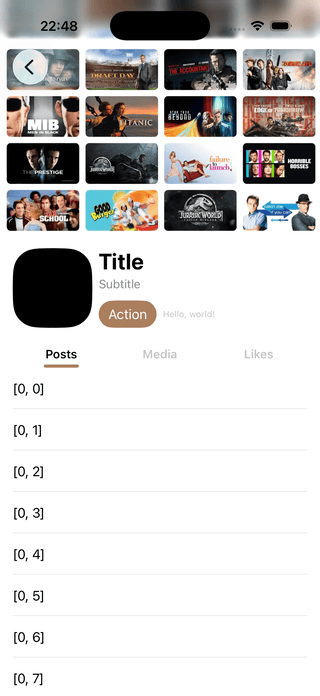

# Header



A stretch header container for UIKit. The header expands and contracts with scrolling, and lets you lay out both content and a palette (such as a row of buttons) inside the header.

## Features
- The header expands when the user pulls down.
- `HeaderView` stacks `backgroundView`, `contentView`, and `paletteView` for flexible layouts.
- Syncs scroll positions when switching pages (via `willMove` / `didMove`).
- Exposes scroll state changes via `HeaderViewControllerDelegate`.

## Requirements
- iOS 18+
- Swift 6

## Installation (Swift Package Manager)
In Xcode, use “Add Packages” to add this repository, then select the `Header` target.

## Usage
1. Create a root view controller that can provide a scroll view via `contentScrollView(for:)`.
   - `UICollectionViewController` / `UITableViewController` already implement this.
   - For custom controllers, override `contentScrollView(for:)` to return your scroll view.
2. Create `HeaderViewController(rootViewController:)`.
3. Configure the header via `headerView.backgroundView`, `headerView.contentView`, and `headerView.paletteView`.
4. If you switch pages, notify the header using `scrollView.willMove(to:)` and `scrollView.didMove(to:)`.

### Minimal Example (single scroll view)
```swift
import UIKit
import Header

let rootViewController = UITableViewController(style: .plain)
let headerViewController = HeaderViewController(rootViewController: rootViewController)

let headerImageView = UIImageView(image: UIImage(named: "header"))
headerImageView.contentMode = .scaleAspectFill
headerViewController.headerView.backgroundView = headerImageView

let headerContentView = UIView()
headerViewController.headerView.contentView = headerContentView

let paletteView = UIView()
headerViewController.headerView.paletteView = paletteView

let navigationController = UINavigationController(rootViewController: headerViewController)
```

### Page Containers (UIPageViewController)
When changing pages, notify the header so it can sync scroll offsets.
```swift
final class PagesViewController: UIPageViewController, UIPageViewControllerDelegate {
    override func viewDidLoad() {
        super.viewDidLoad()
        delegate = self
    }

    func pageViewController(_ pageViewController: UIPageViewController, willTransitionTo pendingViewControllers: [UIViewController]) {
        let scrollView = pendingViewControllers.compactMap { $0.contentScrollView(for: .top) }.first!
        scrollView.willMove(to: headerViewController!)
    }

    func pageViewController(_ pageViewController: UIPageViewController, didFinishAnimating finished: Bool, previousViewControllers: [UIViewController], transitionCompleted completed: Bool) {
        guard finished, completed else { return }
        if let scrollView = viewControllers?.first?.contentScrollView(for: .top) {
            scrollView.didMove(to: headerViewController!)
        }
    }
}
```

### Using SwiftUI Views
Attach a `UIHostingController` as a child and assign its `view` to the header. See `Example.swiftpm` for a concrete example.

## Example App
```sh
open Example.swiftpm
```

## Build / Test
```sh
swift build
swift test
```

## License
MIT. See `LICENSE`.
